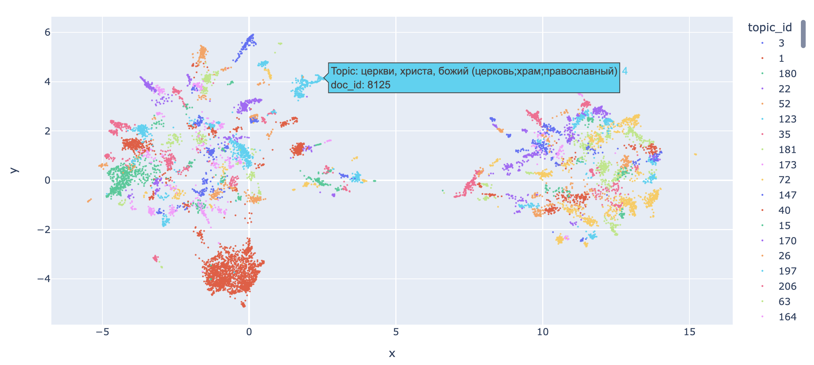

# 🔖 ru-BERTopic
Using BERT embeddings with c-TF-IDF for Topic modeling in Russian language

## Getting started
Getting embeddings, tokenizing and lemmatizing large chunks of data takes some time, and if you just want to see how it works, you can download already preprocessed [dataset of russian news](https://www.kaggle.com/datasets/vfomenko/russian-news-2020) here -> [Google Drive](https://drive.google.com/drive/folders/1S5QGiTMdIQUvtX_4bN359wzmqtx6IxHj?usp=sharing).

| Name  | Link  |
|---|---|
| ru-BERTopic main notebook |   |

## Visualisation
Visualization implemented with plotly provides semi-interactive figures. You can play with it in the notebook above. Hovering over a point representing a single document reveals its topic and id for deeper digging-in.

